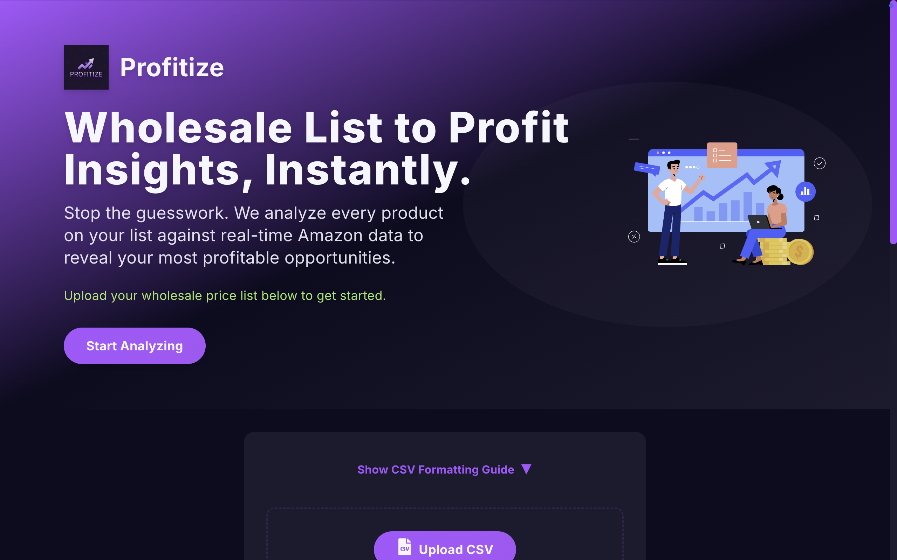

# 🚀 FBA Profit Model

Welcome to **FBA Profit Model** – a lightning-fast, no-login, AI-enhanced tool to help Amazon FBA sellers instantly check profit margins on their product lists! 📦📈

🔗 **Live App**: [www.fba-scout.profitize.org](www.fba-scout.profitize.org)

---

## 🧠 What It Does

FBA Profit Model helps you:

✅ Upload a `.csv` file of products  
✅ Instantly scrape Amazon to check the current product prices  
✅ Match with your **starting wholesale price**  
✅ Identify which products meet a minimum profit margin (25%+)  
✅ Export back only the profitable items  

> 🔒 No signups, no logins. Just drop your CSV and get results – built for speed and simplicity.

---

## 📁 Required CSV Format

**Required Columns:**
- `Description` (e.g., Wireless Mouse)
- `Starting wholesale Price` (e.g., 12.99)

**Optional Column:**
- `Category` (e.g., Electronics)

Download the [example template](https://fbaprofitmodel.profitize.org/sample.csv) to get started!

---

## 🔍 Tech Stack

- 🧠 **Backend**: Python + Flask + Selenium for real-time scraping
- 🧰 **Frontend**: React (via Netlify) with a clean, intuitive UI
- 🌐 **Hosting**: Backend on Render, frontend on Netlify with custom domain + SSL
- 📦 **Dependencies**: Pandas, BeautifulSoup, Express middleware, and more

---

## 🛠️ How to Contribute

We welcome contributions from the community! Want to improve CSV parsing, scraping performance, or the UI? Here's how:

1. Fork this repo 🍴
2. Create a new branch: `git checkout -b feature/amazing-feature`
3. Commit your changes: `git commit -m 'Add awesome feature'`
4. Push to the branch: `git push origin feature/amazing-feature`
5. Submit a Pull Request 🚀

---

## 🙌 Contributors

- 💻 Built by: [@avirmani2024](https://github.com/avirmani2024) and [@ParshawnH](https://github.com/ParshawnH)
- 🧠 AI Co-Pilot: ChatGPT-4o

---

## 📄 License

MIT License – see [`LICENSE`](./LICENSE) file for details.
